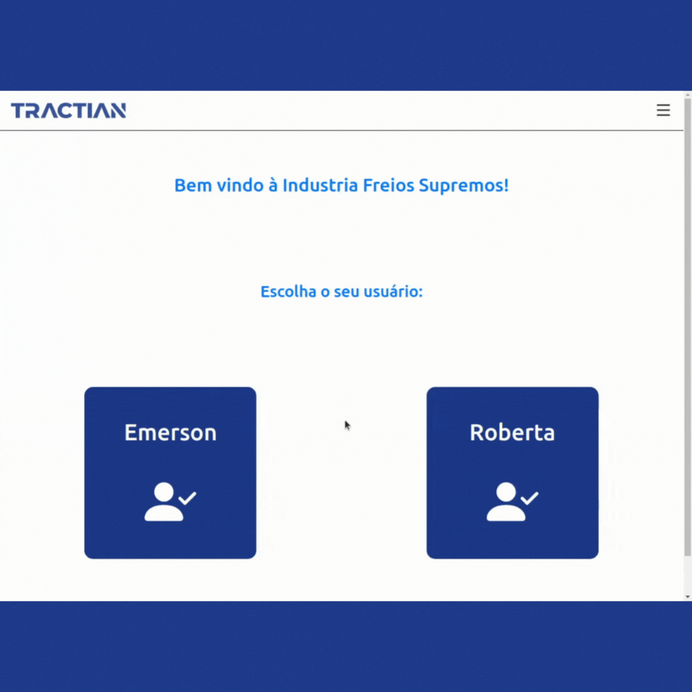
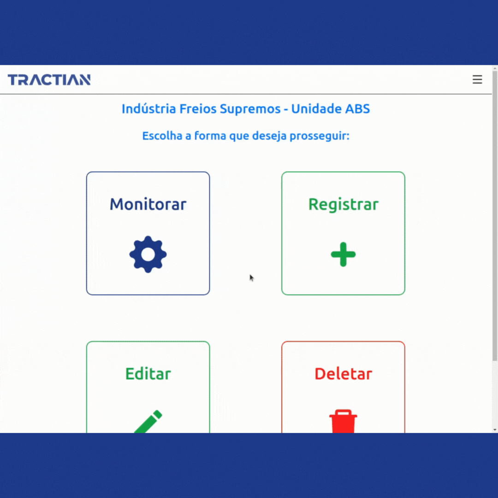
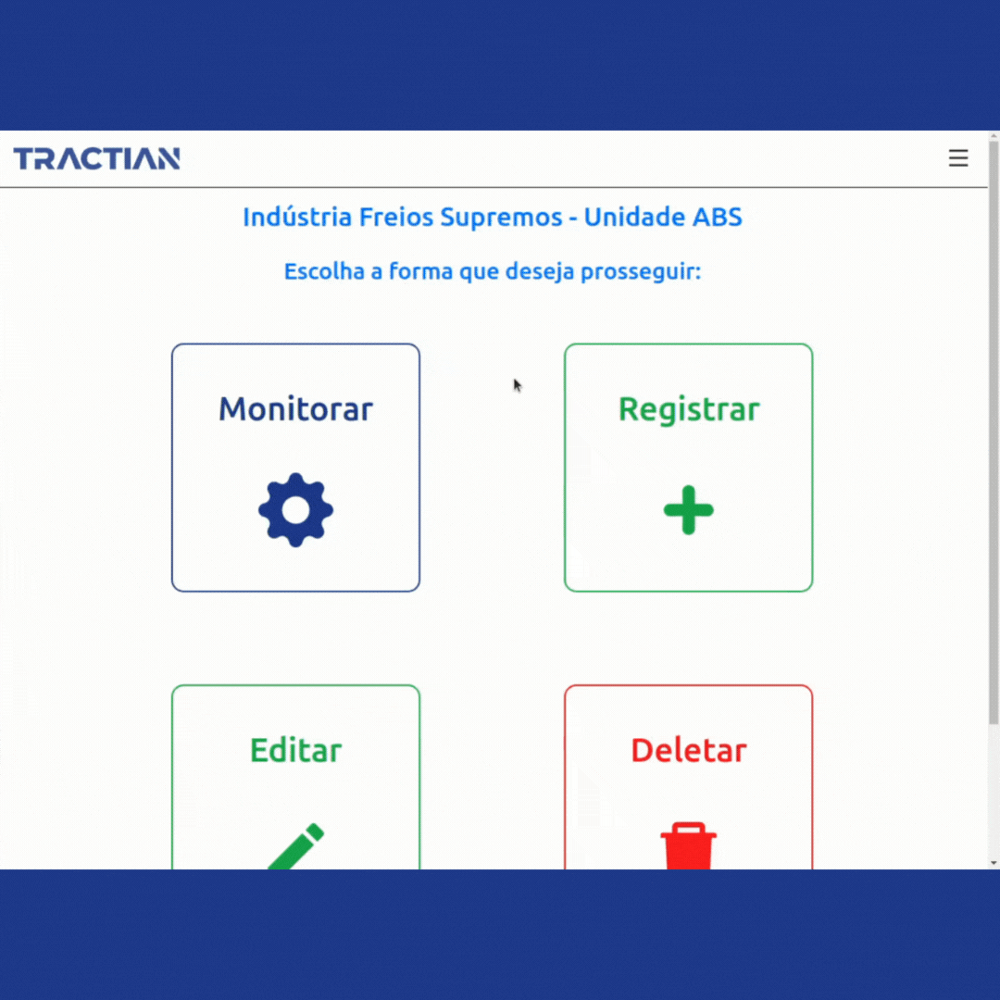

# TRACTIAN MONITORING APP







## Descrição :memo:

Esta aplicação tem como objetivo gerenciar dados de ativos de uma empresa.

Através da interface, é possível gerar gráficos, adicionar novos ativos para monitorar, excluir e editar ativos, de acordo com a necessidade do usuário.

Todos os dados dos ativos e dos usuários são gerenciados em um banco de dados.

Ela está hospedada em um domínio, através do Vercel, e pode ser acessada por este link [aqui](https://tractian-ft.vercel.app/).

---

## Tecnologias :wrench:

- ReactJs;
- CSS;
- [HighCharts](https://www.highcharts.com/);
- [BootStrap](https://getbootstrap.com/);
- [React-BootStrap](https://react-bootstrap.github.io/);
- ESLint;
- Vercel;
- CI/CD.

---

## Instalando a aplicação :file_cabinet:

Para clonar o repositório para a sua máquina e instalar as dependências, basta rodar o comando: 

- *Para chave SSH* 

```
git clone git@github.com:andremoraes98/tractian-ft.git && cd tractian-ft && npm install
```

Depois das dependências instaladas, basta rodar o comando:

```
npm start
```

Feito isso, a aplicação estará rodando localmente. Se não configurada uma porta específica, por padrão, a aplicação roda na porta 3000.

Depois que ela estiver rodando, basta seguir o fluxo do CRUD ou apenas monitorar o ativo respectivo de cada unidade.

## Implementação futura :soon:

- Filtro para cada cada ativo na página de monitoramento;

--- 

Feito com muito empenho, dedicação e esforço por [eu mesmo](https://www.linkedin.com/in/moraesandre/).